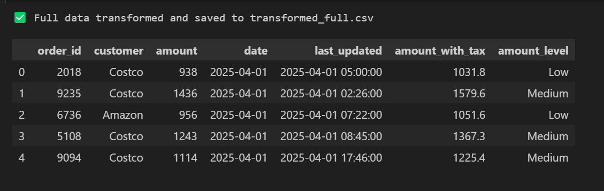

# ETL Extract & Load Lab

**Name:** Paul Mbuvi  
**Student ID:** 669984  

---

## 🔍 Description
This project demonstrates Full and Incremental **Extraction** and **Loading** techniques using a synthetic sales dataset. The notebooks walk through the ETL process including loading the transformed data into structured formats like **Parquet** and **SQLite**.

---

## 🛠️ Tools Used
- Python
- Pandas
- SQLite (via `sqlite3`)
- fastparquet
- Jupyter Notebook

---

## 🚀 How to Run

### 1. Extraction
1. Open `etl_extract.ipynb`
2. Run all cells to simulate full and incremental extraction

### 2. Load
1. Open `3_etl_load.ipynb`
2. Run all cells to:
   - Load transformed CSVs
   - Save data to Parquet files
   - Save data to SQLite databases
   - Preview contents

---

## 📁 Files

| File/Folder                 | Description                                  |
|----------------------------|----------------------------------------------|
| `etl_extract.ipynb`        | Extraction logic                             |
| `3_etl_load.ipynb`         | Loading logic (Parquet + SQLite)             |
| `transformed/`             | Contains cleaned `transformed_full.csv` and `transformed_incremental.csv` |
| `loaded/`                  | Output folder for `.parquet` and `.db` files |
| `custom_data.csv`          | Simulated dataset used for extraction        |
| `last_extraction.txt`      | Stores timestamp for incremental extraction  |
| `.gitignore`               | File/folder exclusions for Git tracking      |

## 📷 Screenshots

### 🧾 Full Extraction

---

### 🔁 Incremental Extraction

---

### 💾 Save New Timestamp

### Transformed Full Dataset

- I made changes and new code improvements in VS Code.
- Handled missing values using `.fillna()` with median imputation for numerical columns.
- Added a tax column (`amount_with_tax`) and categorized amounts into levels.
- Applied the same transformations to both the full and incremental datasets for consistency.
- Saved results to `transformed/transformed_full.csv` and `transformed/transformed_incremental.csv`.

### Transformed Incremental Dataset

