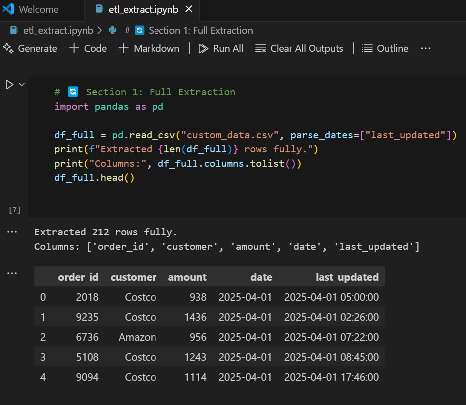
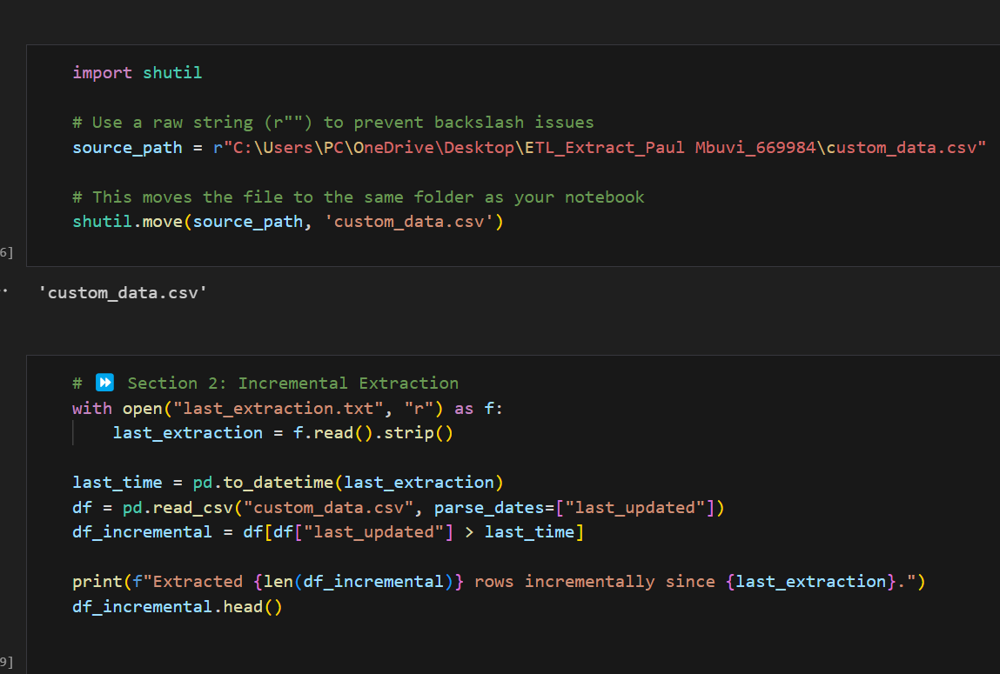
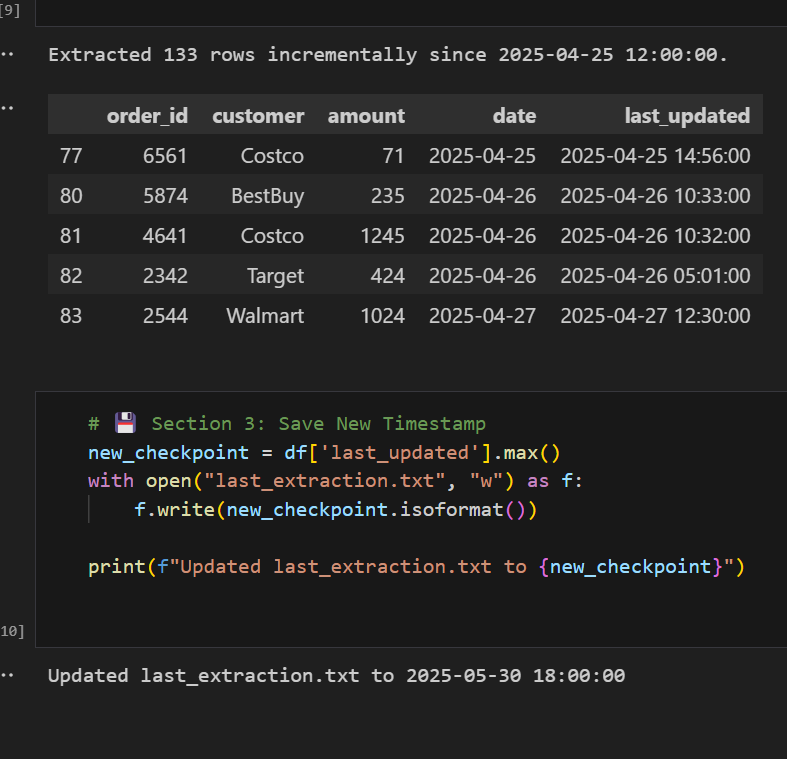

# ETL Extract Lab

**Name:** Paul Mbuvi  
**Student ID:** 669984  

## 🔍 Description
This project demonstrates Full and Incremental Extraction techniques using a synthetic sales dataset. The notebook walks through both extraction methods using realistic sales data generated with Python.

## 🛠️ Tools Used
- Python
- Pandas
- Jupyter Notebook

## 🚀 How to Run
1. Open `etl_extract.ipynb` in Jupyter.
2. Run all cells to perform full extraction and simulate incremental extraction.
3. Dataset used: `custom_data.csv` (60 days of sales transactions).

## 📁 Files
- `etl_extract.ipynb`: Notebook with all ETL logic.
- `custom_data.csv`: Generated dataset.
- `last_extraction.txt`: Timestamp for incremental extraction.
- `.gitignore`: To ignore unneeded files in Git.

## 📷 Screenshots
## 📊 ETL Extraction Overview

### 🧾 Full Extraction
- In this step, I was able to load the full dataset from `custom_data.csv`.

---

### 🔁 Incremental Extraction
- In this section, I was able to read the last extraction timestamp and only pull new rows.

---

### 💾 Save New Timestamp
- Finally after extraction, the latest timestamp is saved to track future changes.

